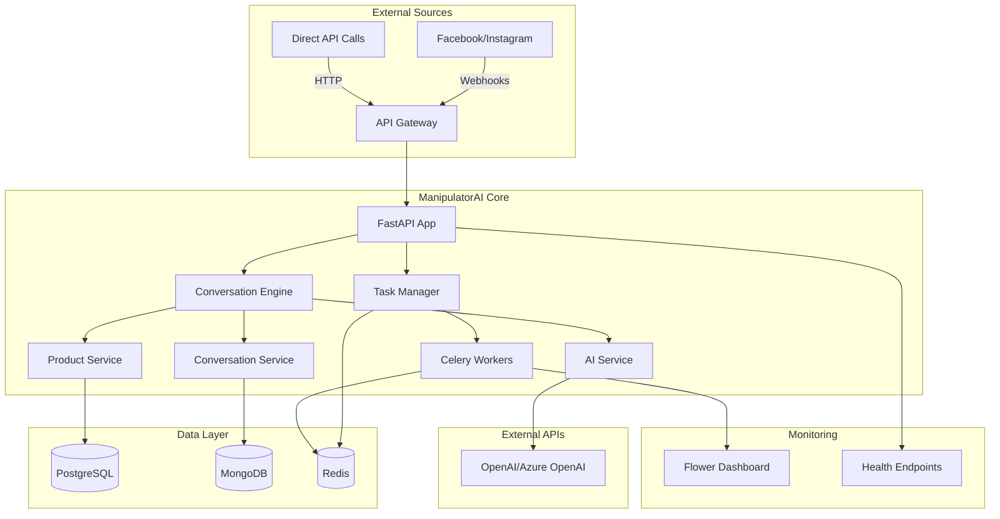

# 🧪 ManipulatorAI End-to-End Testing Guide

## 📋 Complete Developer Testing Walkthrough

This guide provides a comprehensive walkthrough for testing ManipulatorAI from a developer perspective, including data flow analysis and practical testing scenarios.

---

## 🏗️ System Architecture Overview



---

## 🚀 Quick Setup for Testing

### 1. Environment Setup

```bash
# Clone and setup
cd /Users/Kazi/Desktop/Manipulator-Demo

# Copy environment configuration
cp .env.example .env

# Edit .env with test credentials
# Minimum required for testing:
OPENAI_API_KEY=sk-your-actual-openai-key
SECRET_KEY=test-secret-key-for-development-only
DEBUG=true
```

### 2. Start the Development Environment

```bash
# Option A: Docker (Recommended for full testing)
./scripts/deploy.sh deploy

# Option B: Local development
pip install -r requirements.txt
uvicorn app.main:app --reload --host 0.0.0.0 --port 8000
```

### 3. Verify Services

```bash
# Check health
curl http://localhost:8000/health

# Access API documentation
open http://localhost:8000/docs

# Monitor Celery tasks (if using Docker)
open http://localhost:5555
```

---

## 🔄 Data Flow Analysis

### Flow 1: Social Media Webhook Processing

```
1. Facebook/Instagram Event
   ↓
2. Webhook Endpoint (/webhook/facebook or /webhook/instagram)
   ↓ 
3. Signature Verification (Security)
   ↓
4. Queue Webhook Task (Redis)
   ↓
5. Celery Worker Processes Webhook
   ↓
6. Extract Customer Data & Intent
   ↓
7. Start Conversation (Manipulator Branch)
   ↓
8. AI Service Generates Response
   ↓
9. Store Conversation (MongoDB)
   ↓
10. Send Response Back to Platform
```

### Flow 2: Direct API Conversation

```
1. API Call (/conversation/message)
   ↓
2. Message Validation
   ↓
3. Determine Branch (Manipulator/Convincer)
   ↓
4. Enhanced Conversation Engine
   ↓
5. AI Service Processing
   ↓
6. Product Matching (PostgreSQL)
   ↓
7. Generate Response
   ↓
8. Store Conversation (MongoDB)
   ↓
9. Return Response to Client
```

### Flow 3: Async Task Processing

```
1. API Request with async_processing=true
   ↓
2. Create Task ID
   ↓
3. Queue Task (Redis)
   ↓
4. Return Task ID to Client
   ↓
5. Celery Worker Picks Up Task
   ↓
6. Process in Background
   ↓
7. Store Results
   ↓
8. Client Polls for Results
```

---

## 🧪 Step-by-Step Testing Scenarios

### Test 1: Basic Health Check

```bash
# Test system health
curl -X GET http://localhost:8000/health

# Expected Response:
{
  "status": "healthy",
  "timestamp": "2025-07-16T...",
  "databases": {
    "postgresql": "connected",
    "mongodb": "connected", 
    "redis": "connected"
  }
}
```

### Test 2: Webhook Verification (Facebook)

```bash
# Test Facebook webhook verification
curl -X GET "http://localhost:8000/webhook/facebook?hub.mode=subscribe&hub.verify_token=your_facebook_verify_token&hub.challenge=test_challenge"

# Expected Response: 
test_challenge
```

### Test 3: Direct Conversation - Manipulator Branch

```bash
# Test product-focused conversation
curl -X POST http://localhost:8000/conversation/message \
  -H "Content-Type: application/json" \
  -d '{
    "customer_id": "test_customer_123",
    "message": "Hi, I saw your ad about CRM software",
    "customer_context": {
      "source": "facebook_ad",
      "company_size": "small_business",
      "industry": "retail"
    },
    "conversation_branch": "manipulator"
  }'

# Expected Response:
{
  "conversation_id": "conv_abc123",
  "response": "Hi! Great to hear from you! I'm excited you're interested in our CRM software...",
  "conversation_branch": "manipulator",
  "next_actions": ["product_demo", "feature_highlight"],
  "conversation_state": "active"
}
```

### Test 4: Direct Conversation - Convincer Branch

```bash
# Test discovery-focused conversation
curl -X POST http://localhost:8000/conversation/message \
  -H "Content-Type: application/json" \
  -d '{
    "customer_id": "test_customer_456", 
    "message": "Hello, I need help choosing the right software",
    "customer_context": {
      "source": "direct_message",
      "company_size": "medium_business"
    },
    "conversation_branch": "convincer"
  }'

# Expected Response:
{
  "conversation_id": "conv_def456",
  "response": "Hello! I'd love to help you find the perfect solution...",
  "conversation_branch": "convincer", 
  "next_actions": ["needs_discovery", "solution_matching"],
  "conversation_state": "discovery"
}
```

### Test 5: Async Processing Test

```bash
# Test async task processing
curl -X POST http://localhost:8000/conversation/message?async_processing=true \
  -H "Content-Type: application/json" \
  -d '{
    "customer_id": "test_customer_789",
    "message": "I want to know more about your products",
    "customer_context": {
      "source": "website",
      "urgency": "high"
    }
  }'

# Expected Response:
{
  "task_id": "task_xyz789",
  "status": "queued",
  "message": "Your request is being processed"
}

# Check task status
curl -X GET http://localhost:8000/conversation/task/task_xyz789/status

# Expected Response:
{
  "task_id": "task_xyz789", 
  "status": "completed",
  "result": {
    "conversation_id": "conv_ghi789",
    "response": "I'd be happy to tell you about our products...",
    "processing_time": 2.34
  }
}
```

### Test 6: Conversation Continuation

```bash
# Continue existing conversation
curl -X POST http://localhost:8000/conversation/conv_abc123/message \
  -H "Content-Type: application/json" \
  -d '{
    "message": "That sounds interesting, can you tell me about pricing?",
    "customer_context": {
      "engagement_level": "high",
      "price_sensitivity": "medium"
    }
  }'

# Expected Response:
{
  "conversation_id": "conv_abc123",
  "response": "I'm glad you're interested! Our pricing is very competitive...",
  "conversation_state": "negotiation",
  "next_actions": ["pricing_discussion", "value_proposition"]
}
```

### Test 7: Product Search Integration

```bash
# Test product matching
curl -X POST http://localhost:8000/ai/match-products \
  -H "Content-Type: application/json" \
  -d '{
    "customer_message": "I need software for managing customer relationships",
    "customer_context": {
      "company_size": "small_business",
      "budget_range": "low"
    }
  }'

# Expected Response:
{
  "matched_products": [
    {
      "id": 1,
      "name": "BasicCRM",
      "match_score": 0.92,
      "match_reasons": ["perfect for small business", "budget-friendly"]
    }
  ],
  "conversation_suggestions": [
    "Would you like me to show you how BasicCRM can help your business?"
  ]
}
```

### Test 8: Facebook Webhook Simulation

```bash
# Simulate Facebook webhook event
curl -X POST http://localhost:8000/webhook/facebook \
  -H "Content-Type: application/json" \
  -H "X-Hub-Signature-256: sha256=test_signature" \
  -d '{
    "object": "page",
    "entry": [{
      "id": "page_id",
      "time": 1623456789,
      "messaging": [{
        "sender": {"id": "user_123"},
        "recipient": {"id": "page_456"},
        "timestamp": 1623456789,
        "message": {
          "mid": "msg_789",
          "text": "Hi, I saw your ad about CRM software"
        }
      }]
    }]
  }'

# Expected Response:
{
  "status": "success",
  "message": "Webhook processed successfully",
  "task_id": "webhook_task_123"
}
```

---

## 📊 Monitoring and Debugging

### 1. Check Celery Tasks

```bash
# Access Flower dashboard (if using Docker)
open http://localhost:5555

# Check Redis queue status
redis-cli -h localhost -p 6379
127.0.0.1:6379> LLEN conversation_queue
127.0.0.1:6379> LLEN webhook_queue
127.0.0.1:6379> LLEN analytics_queue
```

### 2. Check Logs

```bash
# Docker logs
docker-compose logs -f app
docker-compose logs -f celery-worker

# Local logs
tail -f logs/api.log
tail -f logs/conversation.log
tail -f logs/task.log
```

### 3. Database Inspection

```bash
# PostgreSQL - Check products
psql -h localhost -U postgres -d manipulator_ai
\dt
SELECT * FROM products LIMIT 5;

# MongoDB - Check conversations  
mongosh mongodb://localhost:27017/manipulator_conversations
db.conversations.find().limit(5)

# Redis - Check task queues
redis-cli -h localhost -p 6379
KEYS *
```

---

## 🎯 Key Testing Checkpoints

### ✅ Essential Tests
- [ ] Health endpoint responds correctly
- [ ] Database connections work
- [ ] Basic conversation flow (manipulator branch)
- [ ] Basic conversation flow (convincer branch)
- [ ] Async task processing
- [ ] Webhook verification
- [ ] AI service integration
- [ ] Product matching works

### 🔧 Advanced Tests
- [ ] Conversation continuation
- [ ] Error handling and recovery
- [ ] Rate limiting
- [ ] Performance under load
- [ ] Security (signature verification)
- [ ] Analytics and insights
- [ ] Cross-platform webhook handling

### 📈 Performance Tests
- [ ] Response time < 200ms for sync operations
- [ ] Task queue processing rate
- [ ] Database query performance
- [ ] Memory usage under load
- [ ] Concurrent user handling

---

## 🚨 Common Issues and Solutions

### Issue 1: Database Connection Failed
```bash
# Check Docker containers
docker-compose ps

# Restart databases
docker-compose restart postgres mongodb redis
```

### Issue 2: AI Service Not Responding
```bash
# Check API key in .env
echo $OPENAI_API_KEY

# Test direct API call
curl -H "Authorization: Bearer $OPENAI_API_KEY" \
     -H "Content-Type: application/json" \
     -d '{"model":"gpt-3.5-turbo","messages":[{"role":"user","content":"test"}]}' \
     https://api.openai.com/v1/chat/completions
```

### Issue 3: Celery Tasks Not Processing
```bash
# Check Celery worker status
celery -A app.core.celery_app:celery_app inspect active

# Restart workers
docker-compose restart celery-worker
```

### Issue 4: High Memory Usage
```bash
# Monitor Docker resources
docker stats

# Optimize worker settings in .env
CELERY_WORKER_MAX_TASKS_PER_CHILD=100
```

---

## 📝 Test Results Documentation

Create a test results log:

```bash
# Create test session log
echo "Test Session: $(date)" >> test_results.log

# Run all tests and log results
./run_test_suite.sh >> test_results.log 2>&1
```

---

## 🎯 Next Steps for Production

1. **Load Testing**: Use tools like `locust` or `artillery`
2. **Security Testing**: Penetration testing and vulnerability scanning  
3. **Integration Testing**: Test with real Facebook/Instagram webhooks
4. **Performance Optimization**: Database indexing, caching strategies
5. **Monitoring Setup**: Prometheus, Grafana, ELK stack

---

This testing guide provides comprehensive coverage of ManipulatorAI's functionality from a developer perspective, ensuring all data flows work correctly and the system performs as expected.
